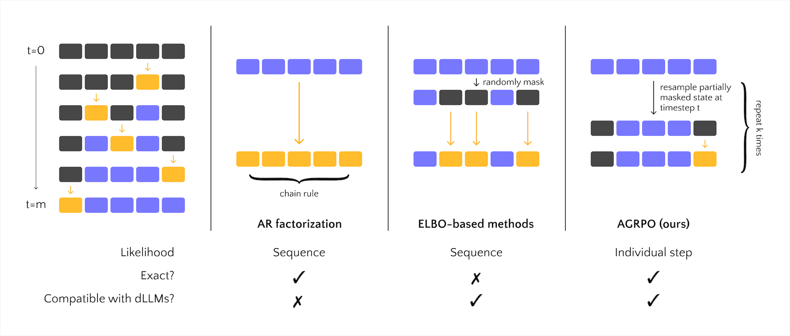

<div align="center">

# AGRPO: Amortized Group Relative Policy Optimization

Official implementation of the paper *Simple Policy Gradients for Reasoning with Diffusion Language Models*

**Anthony Zhan**

Stanford University

[](https://arxiv.org/abs/2510.04019)
[](https://opensource.org/licenses/MIT)
[](mailto:azhan9@stanford.edu)

</div>

## Overview

AGRPO is a policy gradient algorithm designed for masked diffusion LLMs (e.g., [LLaDA](https://github.com/ML-GSAI/LLaDA)). By exploiting the **multi-step Markovian nature** of the generation process, AGRPO sidesteps the need for one-step likelihood approximations or bounds. Instead, the model learns directly from the full range of intermediate masked states, yielding unbiased, **high-fidelity** policy gradients and **stronger reasoning abilities** across multiple tasks.

<p align="center">
  
</p>

## Code Structure

- `train.py` - main RL training entrypoint
- `agrpo_trainer.py` - core AGRPO algorithm implementation
- `agrpo_config.py` - algorithm hyperparameters (including # MC samples, variance reduction)
- `generate.py` - custom dLLM sampler used in train/eval scripts
- `data.py` / `rewards.py` - task-specific preprocessing and reward functions
    - Currently supported tasks: **GSM8K, MATH, Countdown, Sudoku**
- `utils.py` - model/tokenizer loading, dataset utilities
- `eval.py` - evaluation script

## Installation

With `uv` (recommended):

```bash
uv venv && source .venv/bin/activate
uv pip install -r requirements.txt
```

(Also works with `venv` or `conda`: just create and activate your environment and run `pip install -r requirements.txt`)

## Quick Start

To launch a distributed training job on an 8xGPU node, set the appropriate hyperparameters in `train.yaml` and run
```bash
accelerate launch --config_file accelerate.yaml train.py --config train.yaml
```
For GPUs with less VRAM, consider quantization (`load_in_4bit=true`), activation checkpointing (`activation_checkpointing_strategy="one_in_two"`), or lowering the batch size.

## Evaluation

To evaluate a checkpoint on `n` GPUs, run
```bash
accelerate launch --num_processes n eval.py --config eval.yaml --resume_from_checkpoint path/to/checkpoint
```
(or edit the checkpoint path in the .yaml file itself).

> [!NOTE]
> If you're using `torch.compile` (on by default), you might want to set `TORCHDYNAMO_CAPTURE_SCALAR_OUTPUTS=1` to avoid graph breaks.

## Acknowledgements

The main training framework is built on PyTorch and Huggingface's [TRL](https://github.com/huggingface/trl) library. We use  [Math-Verify](https://github.com/huggingface/Math-Verify) for parsing and verification. Sudoku train/test splits and Countdown test split are taken from [SPG](https://github.com/facebookresearch/SPG).

## Citation

If you find AGRPO useful, please cite:
```
@article{zhan2025agrpo,
  title={Simple Policy Gradients for Reasoning with Diffusion Language Models},
  author={Zhan, Anthony},
  journal={arXiv preprint arXiv:2510.04019},
  year={2025}
}
```

## License

This project is licensed under the [MIT License](LICENSE).